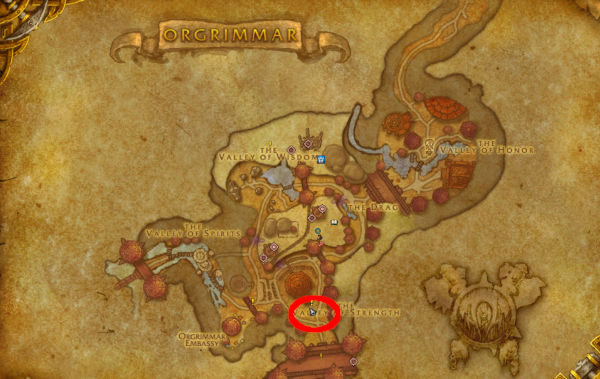
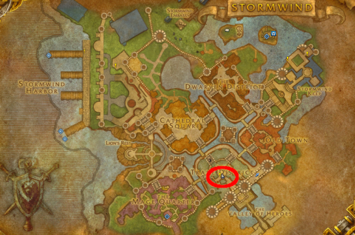

# How to start old expansions at max level (no Chromie)

*(for new and returning players)*

A few requirements before you start:

1. Enable tracking of **low level quests** on your minimap, otherwise you won't see any quests.

  

2. Do not pick up more than one starting quest at the same time, you may end up phased out from NPCs and unable to progress, if that happens, abandon all starting quests and pick again the one you want to do.  
**WARNING**: if you have the latest expansion, the moment you reach the required level on any character, the game will **automatically give you the starting quest** for it - currently it's The War Within at level 70.  
That quest sitting in your log can seriously interfere with other xpac quests, so finish TWW intro *before* you start any other expansion.

3. Buy a **[Soft Foam Sword](https://www.wowhead.com/item=137663/soft-foam-sword)** (50 gold), it allows you to weaken low level enemies without killing them, as required by some quests, you won't be able to at max level without it, not even if you take off all your equipment.  
(it's a toy, after using it you'll find it in your Toy Box Collection - **SHIFT+P** is default keybind to open Collections - drag it to your action bar and use it when needed)  
Here's where to find the vendor in your Capital:

  

4. Throughout the guide I'll be referencing **Hero** and **Command Boards**, if don't know what they are, here's what to look for:

    * [Hero Board - Alliance](images/hero-board.png)
    * [Command Board - Horde](images/command-board.png)

5. Last but not least, here's where to find your **Faction Capital portal rooms**: [Stormwind](images/sw-portal-room.png) - [Orgrimmar](images/org-portal-room.png)

---

## INDEX

* [Dragonflight](#dragonflight)
* [Shadowlands](#shadowlands)
* [Battle for Azeroth (BFA)](#battle-for-azeroth-bfa)
* [Legion](#legion)
* [Warlord of Draenor (WoD)](#warlord-of-draenor-wod)
* [Mists of Pandaria (MoP)](#mists-of-pandaria-mop)
* [Cataclysm](#cataclysm)
* [Wrath of The Lich King (WoTLK)](#wrath-of-the-lich-king-wotlk)
* [The Burning Crusade (TBC)](#the-burning-crusade-tbc)
* [Vanilla Zones (Eastern Kingdoms & Kalimdor)](#vanilla-zones-eastern-kingdoms--kalimdor)

---

## Dragonflight

There is no intro scenario, just a quick starting quest.

There are no requirements to unlock the portal to Valdrakken (main city for both factions), if you can't click it for some reason, do the starting quest and you will.

### ALLIANCE

Go to the left balcony of **Stormwind Keep**, talk to **Wrathion** and get the starting quest [The Dragon Isles Await](https://www.wowhead.com/quest=65436/the-dragon-isles-await).

  

  

  

### HORDE

Go to the Valley of Wisdom in **Orgrimmar**, to the left of the Cataclysm portals you will find **Ebyssian**, talk to him and get the starting quest [The Dragon Isles Await](https://www.wowhead.com/quest=65435/the-dragon-isles-await).

  

  

---

## Shadowlands

Complete the intro scenario to unlock the portal to **Oribos** (main city for both factions) in your capital portal room.  
Fully playing the intro once will allow you to skip it on every other character in your account.

### ALLIANCE
Go to Stormwind, on the stairs to **Stormwind Keep** there's a group of death knights with **Darion Mograine** among them, he will give you the starting quest [Shadowlands: A Chilling Summons](https://www.wowhead.com/quest=60545/shadowlands-a-chilling-summons).

  

  

### HORDE
Go to Orgrimmar, in front of **Grommash Hold** (Valley of Strenght) there's a group of death knights with **Darion Mograine** among them, he will give you the starting quest [Shadowlands: A Chilling Summons](https://www.wowhead.com/quest=61874/shadowlands-a-chilling-summons).

  

  

---

## Battle for Azeroth (BFA)

Fully playing the intro once will allow you to skip it on every other character in your account.

### ALLIANCE
Go to Stormwind, the starting quest [Tides of War](https://www.wowhead.com/quest=46727/battle-for-azeroth-tides-of-war) is given by the **Hero's Herald NPC** standing next to a Hero Board (not the board itself).

  

  

Play BFA story quests until you can setup mage portals in **Boralus** (main city for Alliance), that will unlock the portal to Boralus in Stormwind portal room.

### HORDE 
Go to Orgrimmar, the starting quest [Mission Statement](https://www.wowhead.com/quest=51443/battle-for-azeroth-mission-statement) is given by the **Warchief's Herald NPC** standing next to a Command Board (not the board itself).

  

  

Play BFA story quests until you can setup mage portals in **Zuldazar** (main city for Horde), that will unlock the portal to Zuldazar in Orgrimmar portal room.

---

## Legion

Fully playing the intro once will allow you to skip it on every other character in your account.

There are no specific requirements to unlock the portal to Legion in your capital portal room.

**WARNING:** 
While the main city for Legion is **Dalaran** (for both factions), the portal to Dalaran in capital portal rooms DOES NOT port you to Legion, but to the original Dalaran located in Northend (Wrath of the Lich King xpac).

If you want to go to Legion via portal, you need to take the portal to **Azsuna**, then you can fly to Legion Dalaran.

At the end of the intro scenario, you will get a [toy hearthstone](https://www.wowhead.com/item=140192/dalaran-hearthstone) that can teleport you to (Legion) Dalaran.  
On your alts you will need to play the intro (or skip it) before you can use the stone.

### ALLIANCE

Go to **Stormwind**, click on a **[Hero Board](images/hero-board.png)** and choose [Broken Shore/Fight the Legion](https://www.wowhead.com/quest=40519/legion-the-legion-returns).

If the option is not there, pick up all irrelevant quests until "Broken Shore/Fight the Legion" shows up, pick it up and abandon the rest.

  

### HORDE

Go to **Orgrimmar**, click on a **[Command Board](images/command-board.png)** and choose [Broken Shore/Fight the Legion](https://www.wowhead.com/quest=43926/legion-the-legion-returns).

If the option is not there, pick up all irrelevant quests until "Broken Shore/Fight the Legion" shows up, pick it up and abandon the rest.

  

---

## Warlord of Draenor (WoD)

You need to play the intro on all your characters to be able to setup your Garrison, players have found a few ways to skip the scenario on alts but they're not "official" skips so do it at your own risk.

### ALLIANCE

Go to **Stormwind**, click on a **[Hero Board](images/hero-board.png)** and choose [Tanaan Jungle/Enter the Dark Portal](https://www.wowhead.com/quest=34398/warlords-of-draenor-the-dark-portal).

  

If the option is not there, go to [Stormwind Mage Tower](images/sw-portal-room.png), don't go up to the portal room but downstairs, right at the entrance, talk to "Honor Hold Mage" and click "I must report to the Dark Portal".

  

You'll be teleported to the Blasted Lands, directly next to Khadgar, talk to him and accept the quest [Warlords of Draenor: The Dark Portal](https://www.wowhead.com/quest=36881/warlords-of-draenor-the-dark-portal).

  

### HORDE

Go to Orgrimmar, click on a **[Command Board](images/command-board.png)** and choose [Tanaan Jungle/Enter the Dark Portal](https://www.wowhead.com/quest=34398/warlords-of-draenor-the-dark-portal).

  

If the option is not there, go to [Orgrimmar portal room](images/org-portal-room.png), **go downstairs**, talk to "Thrallmar Mage" and click on "I must report to the Dark Portal".

  

You'll be teleported to the Blasted Lands, directly next to Khadgar, talk to him and accept the quest [Warlords of Draenor: The Dark Portal](https://www.wowhead.com/quest=36881/warlords-of-draenor-the-dark-portal).

  

---

## Mists of Pandaria (MoP)

There are no specific requirements to unlock the portal (Jade Forest).

### ALLIANCE

Go to **Stormwind**, click on a **[Hero Board](images/hero-board.png)** and choose [The Jade Forest/Report to Stormwind Keep](https://www.wowhead.com/quest=49556/heros-call-jade-forest).

If the option is not there, pick up all irrelevant quests until "The Jade Forest/Report to Stormwind Keep" shows up, pick it up and abandon the rest.

  

### HORDE

Go to Orgrimmar, click on a **[Command Board](images/command-board.png)** and choose [The Jade Forest/Report to Grommash Hold](https://www.wowhead.com/quest=49538/warchiefs-command-jade-forest).

If the option is not there, pick up all irrelevant quests until "The Jade Forest/Report to Grommash Hold" shows up, pick that and abandon the rest.

  

---

## Cataclysm

There is no intro scenario, but 5 zones that can be played independently, the original leveling path was:

1. Vashj'ir / Mount Hyjal
2. Deepholm
3. Uldum
4. Twilight Highlands

All except Deepholm are located in Kalimdor and the Eastern Kingdoms (original vanilla continents) so you can fly to them if you want, tho be aware some places will be empty until you play their stories (no NPC no flightmasters).

### ALLIANCE

Go to **Stormwind**, click on a **[Hero Board](images/hero-board.png)** and pick up the quests that have the same name of the zones, you can safely take all 5.

You might need to pick up some irrelevant quests for all 5 to show up, abandon the irrelevant ones when done.

  

* [Hero's Call: Vashj'ir!](https://www.wowhead.com/quest=27724/heros-call-vashjir)
* [Hero's Call: Mount Hyjal!](https://www.wowhead.com/quest=27726/heros-call-mount-hyjal)
* [Hero's Call: Deepholm!](https://www.wowhead.com/quest=27727/heros-call-deepholm)
* [Hero's Call: Uldum!](https://www.wowhead.com/quest=28558/heros-call-uldum)
* [Hero's Call: Twilight Highlands!](https://www.wowhead.com/quest=28716/heros-call-twilight-highlands)

After starting their stories, you will unlock the portals to each zone, they're not in the portal room, but next to Stormwind Keep, where the Pandaren air balloon is (you can see it from a distance).

  

### HORDE

Go to Orgrimmar, click on a **[Command Board](images/command-board.png)** and and pick up the quests that have the same name of the zones, you can safely take all 5.

You might need to pick up some irrelevant quests for all 5 to show up, abandon the irrelevant ones when done.

  

* [Warchief's Command: Vashj'ir!](https://www.wowhead.com/quest=27718/warchiefs-command-vashjir)
* [Warchief's Command: Mount Hyjal!](https://www.wowhead.com/quest=27721/warchiefs-command-mount-hyjal)
* [Warchief's Command: Deepholm!](https://www.wowhead.com/quest=27722/warchiefs-command-deepholm)
* [Warchief's Command: Uldum!](https://www.wowhead.com/quest=28557/warchiefs-command-uldum)
* [Warchief's Command: Twilight Highlands!](https://www.wowhead.com/quest=28717/warchiefs-command-twilight-highlands)

After starting their stories, you will unlock the portals to each zone, they're not in the portal room, but in the Valley of Wisdom, north of the zeppelins.

  

---

## Wrath of The Lich King (WoTLK)

There is no intro scenario nor main storyline like later xpacs.

There is a starting quest on the Hero/Command Board ([Alliance](https://www.wowhead.com/quest=28709/heros-call-borean-tundra) / [Horde](https://www.wowhead.com/quest=28711/warchiefs-command-borean-tundra)), but you would need to pick up so many higher level quests before you get to it that it's not worth it.

Just travel there and start questing, you won't miss anything by doing so.

### ALLIANCE

Go to **Stormwind Harbor** and take the boat to **Borean Tundra**.

  

Once there, go past the Inn right in front of you and get the first quest [Enlistment Day](https://www.wowhead.com/quest=11672/enlistment-day) from Recruitment Officer Blythe.

  

### HORDE

Go to **Orgrimmar**, go to the leftmost zeppelin tower and take the zeppelin to **Borean Tundra**.

  

Once there, pick up the first quest [Hellscream's Vigil](https://www.wowhead.com/quest=11585/hellscreams-vigil) from Warsong Recruitment Officer.

  

---

## The Burning Crusade (TBC)

There is no intro scenario nor main storyline like later xpacs.

There is a starting quest on the Hero/Command Board ([Alliance](https://www.wowhead.com/quest=28708/heros-call-outland) / [Horde](https://www.wowhead.com/quest=28705/warchiefs-command-outland)), but you would need to pick up so many higher level quests before you get to it that it's not worth it.

Just travel there and start questing, you won't miss anything by doing so.

### ALLIANCE

Go to [Stormwind Mage Tower](images/sw-portal-room.png), don't go up to the portal room but downstairs, right at the entrance, talk to "Honor Hold Mage" and click "I must report to the Dark Portal" - this is the same as Draenor/WoD.

  

You'll be teleported to the Blasted Lands, directly next to Khadgar - **if you haven't done Draenor yet, don't pick up Khadgar quest and don't go through the Portal**, it will send you to Draenor, we want to go to Outland instead.

Open your map and look for a **chat bubble icon**, that's [Zidormi](https://www.wowhead.com/npc=88206/zidormi), go talk to her and click "Show me the Blasted Lands before the invasion".

  

That will send you back in time to Outland "times", go back to the Dark Portal in the center of the map, check that it's green (not red anymore) and walk through it.

  

On the other side, go down the stairs, turn left and pick up the starting quest [Arrival in Outland](https://www.wowhead.com/quest=10288/arrival-in-outland) from Commander Duron.

  

**WARNING**: until you reset the time in Blasted Lands, if you talk again to "Honor Hold Mage" in the mage tower, you'll be sent to Outland. If you go there by mistake, there's a portal to Stormwind on your left.

  

### HORDE

Go to [Orgrimmar portal room](images/org-portal-room.png), **go downstairs**, talk to "Thrallmar Mage" and click on "I must report to the Dark Portal" - this is the same as Draenor/WoD.

  

You'll be teleported to the Blasted Lands, directly next to Khadgar - **if you haven't done Draenor yet, don't pick up Khadgar quest and don't go through the Portal**, it will send you to Draenor, we want to go to Outland instead.

Open your map and look for a **chat bubble icon**, that's [Zidormi](https://www.wowhead.com/npc=88206/zidormi), go talk to her and click "Show me the Blasted Lands before the invasion".

  

That will send you back in time to Outland "times", go back to the Dark Portal in the center of the map, check that it's green (not red anymore) and walk through it.

  

On the other side, go down the stairs, turn right and pick up the starting quest [Arrival in Outland](https://www.wowhead.com/quest=10120/arrival-in-outland) from Lieutenant General Orion.

  

**WARNING**: until you reset the time in Blasted Lands, if you talk again to "Thrallmar Mage" in the Orgrimmar portal room, you'll be sent to Outland. If you go there by mistake, there's portal to Orgrimmar on your right.

  

---

## Vanilla Zones (Eastern Kingdoms & Kalimdor)

There is no intro scenario nor main storyline or specific starting quests like later xpacs.

There are some zone quests you can take from a Hero/Command board, but you don't need them.

Just go out in the world, explore and do the quests you find along the way, that was the intended way to play back then.

**NOTE**  
All original vanilla zones have been deeply changed with the Cataclysm expansion, the original versions are not available anymore on retail in any way.  
If you want to experience those, you need to play WoW Classic.

### ALLIANCE

This is just a suggestion.  
Go out of Stormwind into Elwynn Forest and start questing from the Human starting area (Northshire).

  

### HORDE

This is just a suggestion.  
Go out of Orgrimmar into Durotar and start questing from the Orc starting area (Valley of Trials) or the Troll one (Echo Isles) - you can do both.

  

